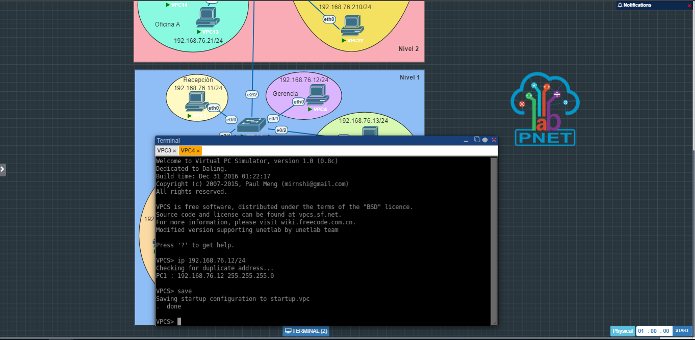
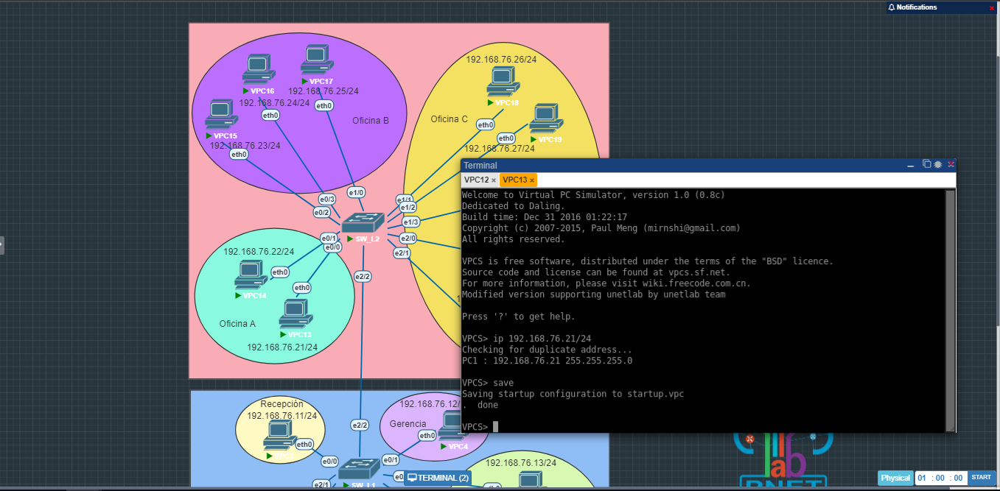
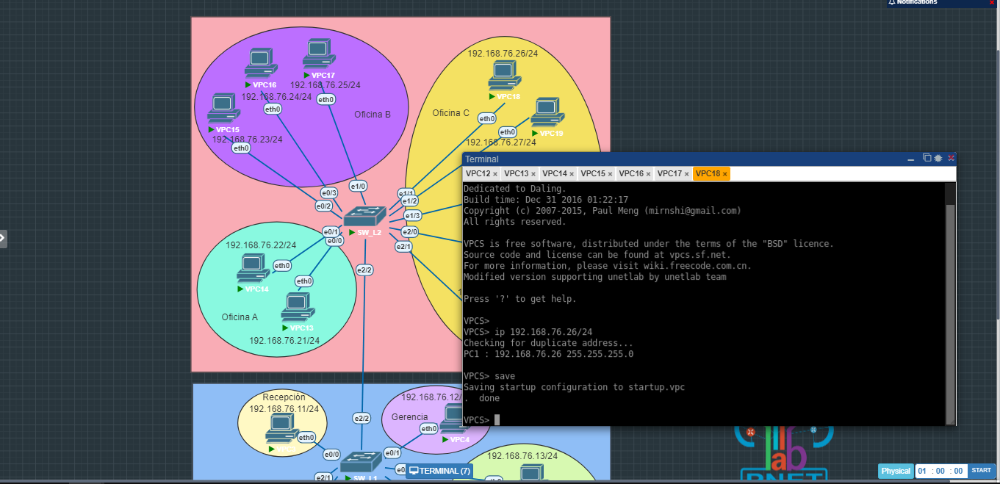
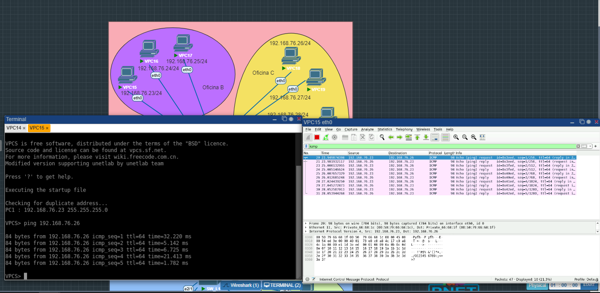
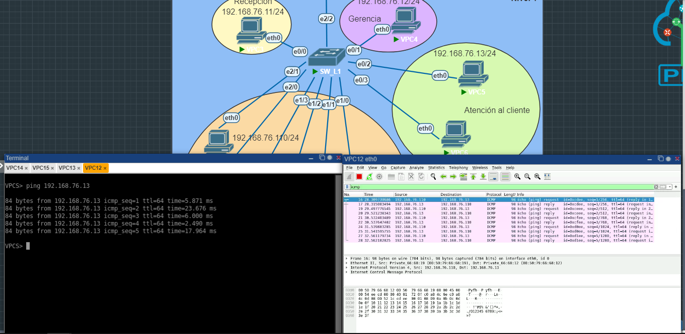
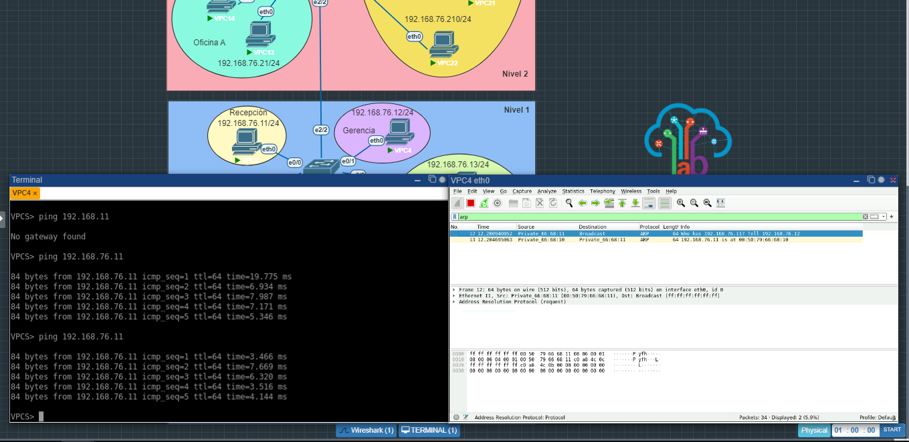

## Manual técnico | Práctica 1 

### _Configuración de las VPCs_
Se realizó la configuración de `20 VPCs` sobre la ip establecida 192.168.76.00, donde el primer digito se refiere al nivel de la red y el segundo se refiere a la vpc del 1-10 sobre las cuales se muestran 7 en general sobre toda la topología, una de cada área especificada a continuación:

- `Recepción` Se muestra el setup de la VPC, como también su respectivo comando save a través de la terminal de PnetLab a través de la ip 192.168.76.11.

- `Gerencia` Se muestra el setup de la VPC, como también su respectivo comando save a través de la terminal de PnetLab a través de la ip 192.168.76.12.

- `Atención al cliente` Se muestra el setup de la VPC, como también su respectivo comando save a través de la terminal de PnetLab a través de la ip 192.168.76.13.

- `Oficinas` Se muestra el setup de la VPC, como también su respectivo comando save a través de la terminal de PnetLab a través de la ip 192.168.76.15.

- `Oficina A` Se muestra el setup de la VPC, como también su respectivo comando save a través de la terminal de PnetLab a través de la ip 192.168.76.21.

- `Oficina B` Se muestra el setup de la VPC, como también su respectivo comando save a través de la terminal de PnetLab a través de la ip 192.168.76.23.

- `Oficina C` Se muestra el setup de la VPC, como también su respectivo comando save a través de la terminal de PnetLab a través de la ip 192.168.76.26.

### _Pings entre hosts_

Se realiza un envio de paquetes haciendo un ping con el filtro `icmp` en WhireShark utilizando su imagen en Docker de la siguiente forma:

- `Ping 1` Se envía un ping desde la VPC con ip 192.168.76.12 en la Gerencia hasta la VPC con ip 192.168.76.23 en la recepción y mostrando el filtro en la imagen de WhireShark.

- `Ping 2` Se envía un ping desde la VPC con ip 192.168.76.23 en la Oficina B hasta la VPC con ip 192.168.76.26 en la Oficina C y mostrando el filtro en la imagen de WhireShark.

- `Ping 3` Se envía un ping desde la VPC con ip 192.168.76.12 en la Gerencia hasta la VPC con ip 192.168.76.13 en atención al cliente y mostrando el filtro en la imagen de WhireShark.

### _Demostración de la captura de un paquete ARP_
Se realiza una demostración realizando un ping entre la VPC con ip 192.168.76.12 en la gerencia y la VPC con ip 192.168.76.11 en la recepción, mientras se muestra en WhireShark con el filtro `arp`.

###### _2023 - Laboratorio de Redes de computadoras 1_
---
