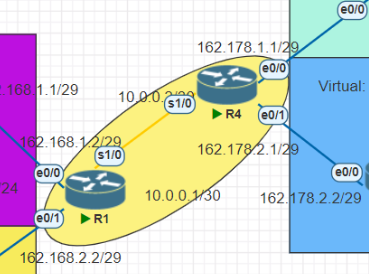
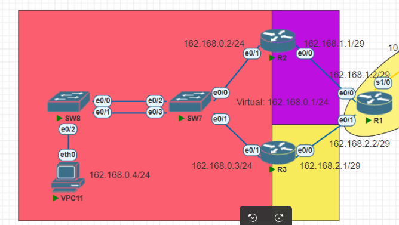
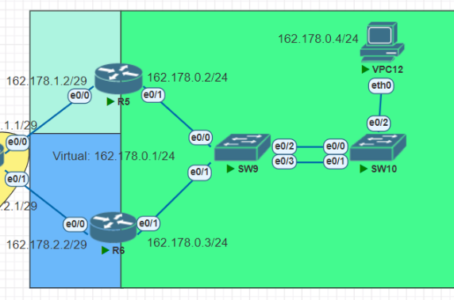

# Manual técnico | Práctica 2 

## _Configuración de Routers_

### Router R1

    configure terminal
    
    interface e0/1
    ip address 162.168.1.2 255.255.255.248
    no shutdown

    interface e0/0
    ip address 162.168.2.2 255.255.255.248
    no shutdown

    interface s1/0
    ip address 10.0.0.1 255.255.255.252
    no shutdown

    ip route 162.168.0.0 255.255.255.0 162.168.1.1
    ip route 162.168.1.0 255.255.255.248 162.168.1.1
    ip route 162.168.2.0 255.255.255.248 162.168.2.1
    ip route 10.0.0.0 255.255.255.252 10.0.0.2
    ip route 162.178.1.0 255.255.255.248 10.0.0.2
    ip route 162.178.2.0 255.255.255.248 10.0.0.2
    ip route 162.178.0.0 255.255.255.0 10.0.0.2

### Router R2

    configure terminal
    
    interface e0/1
    ip address 162.168.0.2 255.255.255.0
    no shutdown

    interface e0/0
    ip address 162.168.1.1 255.255.255.248
    no shutdown

    ip route 162.168.1.0 255.255.255.248 162.168.1.2
    ip route 162.168.2.0 255.255.255.248 162.168.1.2
    ip route 10.0.0.0 255.255.255.252 162.168.1.2
    ip route 162.178.1.0 255.255.255.248 162.168.1.2
    ip route 162.178.2.0 255.255.255.248 162.168.1.2
    ip route 162.178.0.0 255.255.255.0 162.168.1.2

    standby version 2
    standby 21 ip 162.168.0.1
    standby 21 priority 109
    standby 21 preempt
    do write

### Router R5

    configure terminal
    
    interface e0/1
    ip address 162.178.0.2 255.255.255.0
    no shutdown

    interface e0/0
    ip address 162.178.1.2 255.255.255.248
    no shutdown

    ip route 162.168.0.0 255.255.255.0 162.178.1.1
    ip route 162.168.1.0 255.255.255.248 162.178.1.1
    ip route 162.168.2.0 255.255.255.248 162.178.1.1
    ip route 10.0.0.0 255.255.255.252 162.178.1.1
    ip route 162.178.1.0 255.255.255.248 162.178.1.1
    ip route 162.178.2.0 255.255.255.248 162.178.1.1

    glbp 7 ip 162.178.0.1
    glbp 7 preempt
    glbp 7 priority 150
    glbp 7 load-balancing round-robin
    do write

### Switch SW7

    configure terminal
    interface range e0/2-3
    channel-group 1 mode auto
    no shutdown

### VPC11

    ip 162.168.0.4/24 162.168.0.1

## _Resumen de los comandos usados_

### Creación de ruta estática

    ip route [red de destino] [máscara de subred] [siguiente salto]

Donde:
* Red de destino: El id de la red a la que queremos llegar
* Máscara de subred: La máscara de subred de la red de destino
* Siguiente salto: La dirección ip que se encuentra afuera de nuestro router que nos ayudará a llegar al lugar al que queremos ir.

### Creación de PortChannel con PAGP y LACP
Al tener una combinación de dos switches donde se conectan mediante 2 interfaces mutuamente se debe de configurar uno de los siguientes protocolos de la siguiente manera como ejemplo:

*Configuración PAGP

#### Switch A

    configure terminal
    interface range f0/3-4
    channel-group 1 mode desirable
    no shutdown

#### Switch B

    configure terminal
    interface range f0/3-4
    channel-group 1 mode auto
    no shutdown
    
*Configuración LACP

#### Switch A

    configure terminal
    interface range f0/1-2
    channel-group 2 mode active
    no shutdown

#### Switch B

    configure terminal
    interface range f0/1-2
    channel-group 2 mode passive
    no shutdown

### Creación de IP virtual con HSRP y GLBP
La creación de la Ip virtual se utiliza para poder acceder en forma de puente hacia otras redes, por lo que su configuración como ejemplo es de la siguiente manera:

*Configuración HSRP

    standby version 2
    standby 21 ip 10.0.0.1
    standby 21 priority 109
    standby 21 preempt
    do write

*Configuración GLBP

    glbp 7 ip 192.168.0.1
    glbp 7 preempt
    glbp 7 priority 150
    glbp 7 load-balancing round-robin
    do write

### Configuración de VPC
Se utiliza el comando de asignación de ip, pero a diferencia de otra configuración únicamente se le agrega el gateway al comando original de la siguiente manera utilizando la ip virtual:

*Unico comando de configuración

    ip 162.168.0.4/24 162.168.0.1

### _Comandos empleados para los protocolos_

*Comprobación de configuración de PAGP
    
    show etherchannel summary
    show pagp neighbor

*Comprobación de configuración de LACP

    show etherchannel summary
    show lacp neighbor

*Comprobación de configuración de HSRP

    show standby
    show standby brief

*Comprobación de configuración de GLBP

    show glbp brief

###### _2023 - Laboratorio de Redes de computadoras 1_
---
