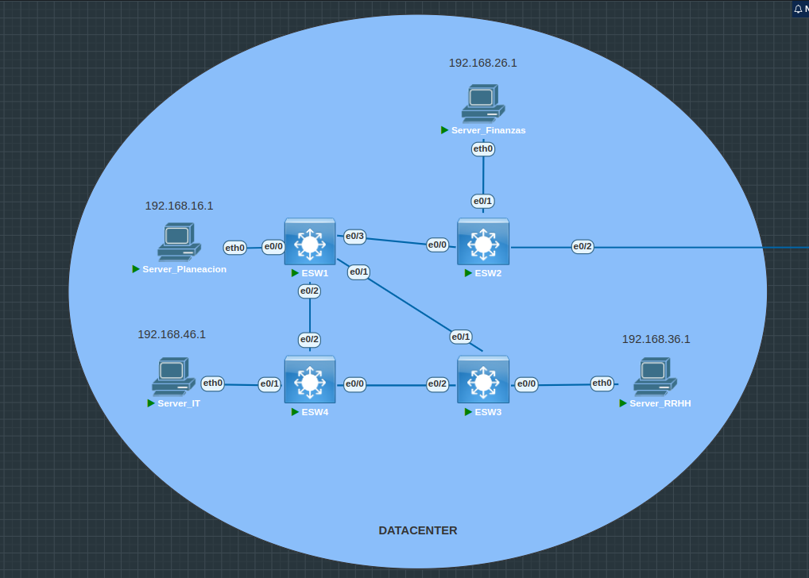
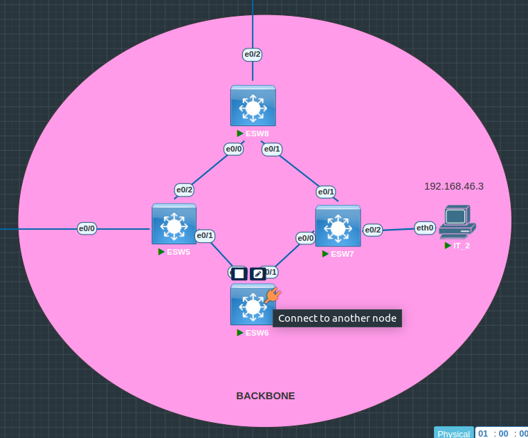
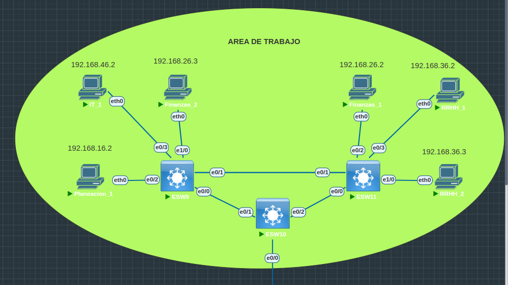
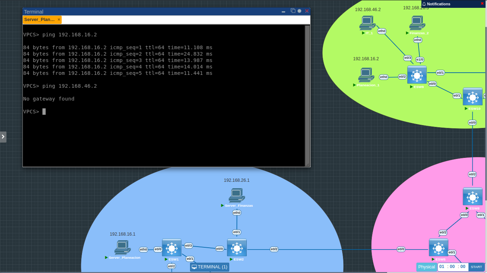

## Manual técnico | Proyecto 1 

### _Resumen de direcciones IP y VLAN_
Estas configuraciones se realizaron mediante la consola de cada VPC en el caso de las direcciones IP, y en el caso de las VLANs se setean únicamente en el server switch encargado de distribuir esta información a los demás, menos al transparent switch sobre el cual se configuran manualmente. A continuación se muestra el formato implementado respectivamente: 

- `Direcciones IP` Se muestra el respectivo formato para cada una de las áreas designadas de trabajo, utilizando como digito 6 para la distinción especifica de este proyecto utilizando el último número de carnet designando así las siguientes ip para cada departamento:

    | Departamento | Formato  | 
    | ----- | -----  | 
    | _Planeación_ | 192.168.16.0/24 | 
    | _Finanzas_ | 192.168.26.0/24 | 
    | _RRHH_ | 192.168.36.0/24 | 
    | _IT_ | 192.168.46.0/24 | 

- `VLANs` Se muestra el setup de las vlans creadas en el proyecto cada una con su respectivo id, utilizando como norma requerida el último dígito de carnet de la siguiente forma para cada departamento solicitado: 

    | Departamento | Formato  | 
    | ----- | -----  | 
    | _Planeación_ | 16| 
    | _Finanzas_ | 26| 
    | _RRHH_ | 36 | 
    | _IT_ | 46 | 

    Estas configuradas a través del server switch, el cual envía la configuración de vlans a los demás client switch, a excepción del transparent switch sobre el cual se configuran las vlans de manera manual para la administración de paquetes enviados.

### _Implementación de topología_
A continuación se muestra la topología implementada en cada uno de los departamentos de la empresa distribuidas en 3 áreas:

- `Datacenter` Se incluyen todos los servidores de todos los departamentos con sus respectivas IPs utilizando el formato especificado con anterioridad:

- `Backbone` Se incluye el server switch y root en en switch ESW5, como también se encuentra el transparent switch el cual es ESW7 hacia la VPC IT_2 con su respectiva IP utilizando el formato especificado con anterioridad:

- `Area de trabajo` Se encuentran la mayoría de VPCs de todos los departamentos con sus respectivas IPs con el formato establecido con anterioridad:

### _Detalle de los comandos utilizados_
Se realizaron varios procesos para la efectividad del proyecto, esto debido a que había que configurar determinados modos sobre las interfaces de los switches, VPC y sobre los mismos switches, por lo que a continuación se muestran los comandos utilizados en este proceso: 

- `Configuración del modo truncal` 

Este tipo de configuración se realiza dentro de las interfaces de los switches que no tienen conexión directa con una VPC:

    interface ethernet 0/0
    switchport trunk encapsulation dot1q
    switchport mode trunk

Para comprobar la efectividad de la configuración se ingresa el siguiente comando:

    show interfaces trunk

- `Configuración del modo acceso`

Este tipo de configuración se realiza dentro de las interfaces de los switches que si tienen conexión directa con una VPC:

    interface ethernet 0/0
    switchport mode access
    switchport access vlan 16

Para comprobar la efectividad de la configuración se ingresa el siguiente comando:

    show VLAN

- `Configuración del server switch`

Esta configuración realizada sobre el switch con hostname ESW5 sobre el cual se configuran las VLANs, se le ingresaron los siguientes comandos para determinar que fuera el server:

    configure terminal
    vtp version 2
    vtp mode server
    do write

- `Configuración del transparent switch`

Esta configuración realizada sobre el switch con hostname ESW7 sobre el cual también se configuran las VLANs, se le ingresó el siguiente comando para determinar que tuviera modo transparencia:

    vtp mode transparent
    do write

- `Configuración de los client switch`

Esta configuración realizada sobre los switch cliente sobre los cuales se recibe la configuración de las VLANs del server switch, se le ingresaron los siguientes comandos sobre cada switch restante para determinar que fuera un cliente:

    configure terminal
    vtp mode client
    do write

- `Configuración del dominio`

Esta configuración realizada sobre cada switch de la topología, establece una correcta conectividad sobre cada uno de estos, para lo cual se ingresaron los siguientes comandos con los datos solicitados:

    vtp domain 201800476
    vtp password usac

- `Configuración de VLANs`

Como se mencionó con anterioridad, esta configuración se establece unicamente sobre el server switch y sobre el transparent switch con los siguientes comandos:

    configure terminal
    vlan 16
    name Planeacion
    vlan 26
    name Finanzas
    vlan 36
    name RRHH
    vlan 46
    name IT
    end

- `Configuración de rapid-vstp`

Esta configuración realizada sobre cada switch de la topología, establece una respuesta y conectividad más rapida y correcta con los siguientes comandos:

    configure terminal
    spanning-tree mode rapid-pvst
    do write

### _Ping entre hosts_
Se muestra la realización de dos pings, uno realizado hacia una VPC que se encuentra en la misma VLAN utilizando la VPC con IP `192.168.16.1` hacia la `192.168.16.2` mostrando un ping efectivo ya que se encuentran como se mencionó con anterioridad en la misma VLAN.

Posteriormente se realiza un ping entre la VPC con IP `192.168.16.1` hacia la `192.168.46.2` la cual es insatisfactoria debido a que se encuentran en VLANs diferentes, por la que no encuentra un camino para encontrar la IP y posteriormente la realización del ping por lo que muestra el mensaje de `No gateway found`

###### _2023 - Laboratorio de Redes de computadoras 1_
---
