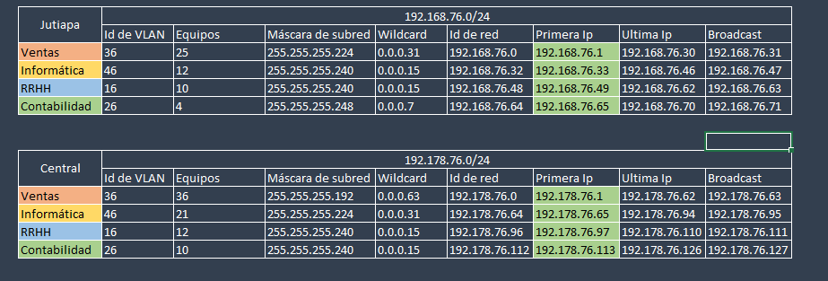
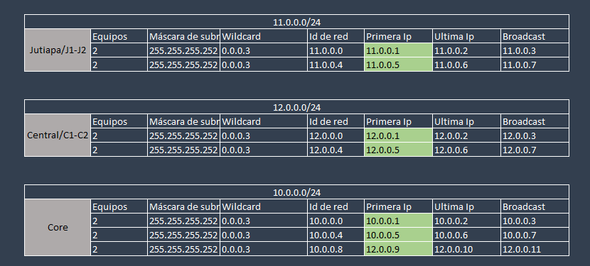
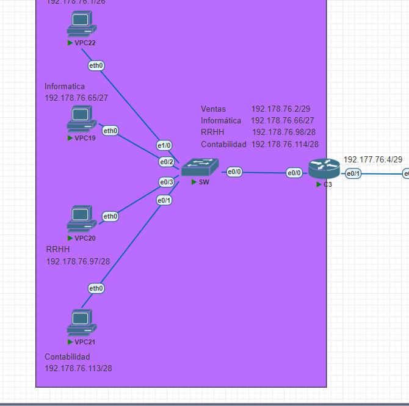
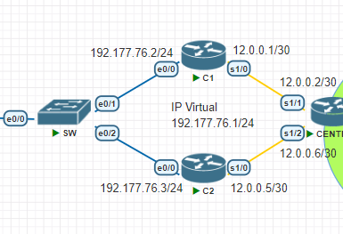
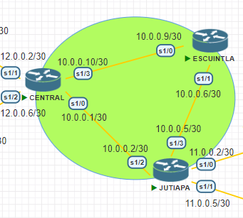
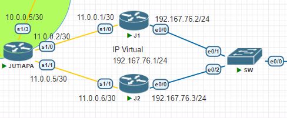
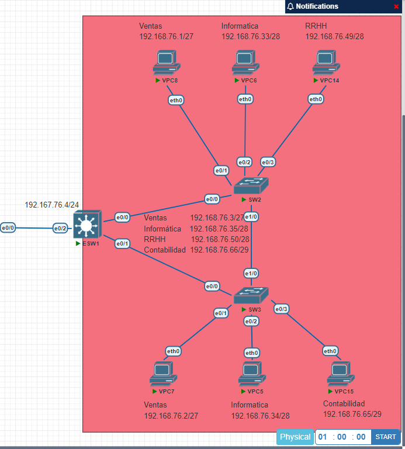

## Manual técnico | Proyecto 2 

### _Resumen de direcciones IP y VLAN_
Estas configuraciones se realizaron mediante la consola de cada VPC en el caso de las direcciones IP, y en el caso de las VLANs se setean únicamente en el server switch ESW1 encargado de distribuir esta información a los demás, menos al SW ubicado en el área central sobre el cual se configuran manualmente. Por lo que se tiene en cuenta para los cálculos que:

* Primera IP = ID de red + 1
* Broadcast = ID de red + Wildcard
* Última IP = Broadcast - 1
* Siguiente ID de red = Broadcast + 1

Se muestra el respectivo formato para cada una de las áreas designadas de trabajo, así como sus vlans, pero en las ips utilizando como digitos 76 para la distinción especifica de este proyecto utilizando el últimos números de carnet designando así las siguientes ip para cada departamento y siendo ordenados por número de equipos, todos los demás calculos de las subredes respectivamente basandose en la utilización de VLSM.

Se muestra las subredes calculadas para los routers de ubicados en las conexiones de Jutiapa/J1-J2, Central/C1-C2 y Core, creadas en el proyecto cada una con su respectiva ip de red solicitada, calculado sobre el número de equipos a utilizar en cada red, estos siendo simetricos por lo que se utiliza FLSM: 

### _Implementación de topología_
A continuación se muestra la topología implementada en cada uno de los departamentos de la empresa distribuidas en 3 áreas:

- `Central` Se incluyen todos las vpcs, minimo una de cada vlan, como también un switch que contiene las mismas y un router C3 que incluye sus respectivas rutas estáticas:

- `Central-Core` Se incluyen los routers para la realización del salto al core y a la central, todo esto en conjunto con su respectiva ip virtual, como también sus subredes mostradas con anterioridad:

- `Core` Se incluyen los routers principales que se usan para conectarse entre redes y que tienen sus propias subredes mostradas con anterioridad, esta área incluye los routers de Jutiapa, Escuintla y Central:

- `Jutiapa-Core` Se incluyen los routers para la realización del salto al core y a Jutiapa, todo esto en conjunto con su respectiva ip virtual, como también sus subredes mostradas con anterioridad:

- `Jutiapa` Se incluyen todos las vpcs, minimo una de cada vlan, como también switches ESW1, SW2 y SW3 que contienen las mismas, ESW1 siendo el root y server el cual funciona con interfaces virtuales:

### _Detalle de los comandos utilizados_
Se realizaron varios procesos para la efectividad del proyecto, esto debido a que había que configurar determinados modos sobre las interfaces de los switches, routers, VPC y sobre los mismos switches, por lo que a continuación se muestran los comandos utilizados en este proceso: 

- `Configuración del modo truncal` 

Este tipo de configuración se realiza dentro de las interfaces de los switches que no tienen conexión directa con una VPC:

    interface ethernet 0/0
    switchport trunk encapsulation dot1q
    switchport mode trunk

Para comprobar la efectividad de la configuración se ingresa el siguiente comando:

    show interfaces trunk

- `Configuración del modo acceso`

Este tipo de configuración se realiza dentro de las interfaces de los switches que si tienen conexión directa con una VPC:

    interface ethernet 0/0
    switchport mode access
    switchport access vlan 16

Para comprobar la efectividad de la configuración se ingresa el siguiente comando:

    show VLAN

- `Configuración del server switch`

Esta configuración realizada sobre el switch con hostname ESW5 sobre el cual se configuran las VLANs, se le ingresaron los siguientes comandos para determinar que fuera el server:

    configure terminal
    vtp version 2
    vtp mode server
    do write

- `Configuración de los client switch`

Esta configuración realizada sobre los switch cliente sobre los cuales se recibe la configuración de las VLANs del server switch, se le ingresaron los siguientes comandos sobre cada switch restante para determinar que fuera un cliente:

    configure terminal
    vtp mode client
    do write

- `Configuración del dominio`

Esta configuración realizada sobre cada switch de la topología, establece una correcta conectividad sobre cada uno de estos, para lo cual se ingresaron los siguientes comandos con los datos solicitados:

    vtp domain dominio
    vtp password pass123

- `Configuración de VLANs`

Como se mencionó con anterioridad, esta configuración se establece unicamente sobre el server switch y sobre el transparent switch con los siguientes comandos:

    configure terminal
    vlan 16
    name RRHH
    vlan 26
    name Contabilidad
    vlan 36
    name Ventas
    vlan 46
    name Informatica
    end

- `Configuración de rapid-vstp`

Esta configuración realizada sobre cada switch de la topología, establece una respuesta y conectividad más rapida y correcta con los siguientes comandos:

    configure terminal
    spanning-tree mode rapid-pvst
    do write

- `Creación de ruta estáticas`

Esta configuración se realiza sobre todos los routers realizando un previo análisis, de la siguiente manera:

    ip route [red de destino] [máscara de subred] [siguiente salto]

    configure terminal
    interface e0/1
    ip address 10.0.0.1 255.255.255.0
    no shutdown

    interface e0/0
    ip address 11.0.0.1 255.255.255.252
    no shutdown

    ip route 11.0.0.0 255.255.255.252 11.0.0.2
    ip route 192.167.0.0 255.255.255.252 11.0.0.2
    ip route 192.168.0.0 255.255.255.0 11.0.0.2

    !Comprobando la configuración
    show ip route
    show running-config | section ip route

- `Configuración HSRP`

Esta configuración se realiza sobre los router que contienen la ip virtual del lado de Jutiapa de la siguiente forma:

    !Router J1 de ejemplo
    standby version 2
    standby 21 ip 192.167.76.1
    standby 21 priority 109
    standby 21 preempt
    do write

- `Configuración GLBP`

Esta configuración se realiza sobre los router que contienen la ip virtual del lado de la Central de la siguiente forma:

    enable
    configure terminal
    glbp 7 ip 192.177.76.1
    glbp 7 preempt
    glbp 7 priority 150
    glbp 7 load-balancing round-robin
    do write

- `Configuración InterVLAN con router`

Para lograr el ruteo intervlan con un router emplearemos subinterfaces, las cuales pueden ser creadas con el siguiente comando, Asumiendo que le crearemos subinterfaces a la interfaz Ethernet 0/0:

    interface Ethernet 0/0.<numero de vlan>
    encapsulation dot1q <numero de vlan>

    interface Ethernet 0/0.10
    encapsulation dot1q 10
    do write

- `Configuración InterVLAN con switch`

Para lograr el ruteo intervlan con un switch de capa 3 emplearemos interfaces virtuales, dentro de esta configuración le asignaremos ip y es importante encender la interfaz con "no shutdown", también hay que recordar habilitar el ruteo IP en nuestro router para que pueda hacer el enrutamiento, esto se logra con el comando (en modo de configuración):

    enable
    configure terminal
    switchport trunk encapsulation dot1q
    switchport mode trunk
    interface vlan 10
    ip address 192.168.1.1 255.255.255.0
    no shutdown
    interface vlan 20
    ip address 192.168.2.1 255.255.255.0
    no shutdown
    exit
    ip routing
    do write

- `Asignación de IPs a VPCs`

Esta es la única configuración que se realiza sobre las mismas, utilizando el gateway del switch ESW1 y router C3 según su respectiva área:

    ip 192.178.76.65 255.255.255.224 192.177.76.4

###### _2023 - Laboratorio de Redes de computadoras 1_
---
